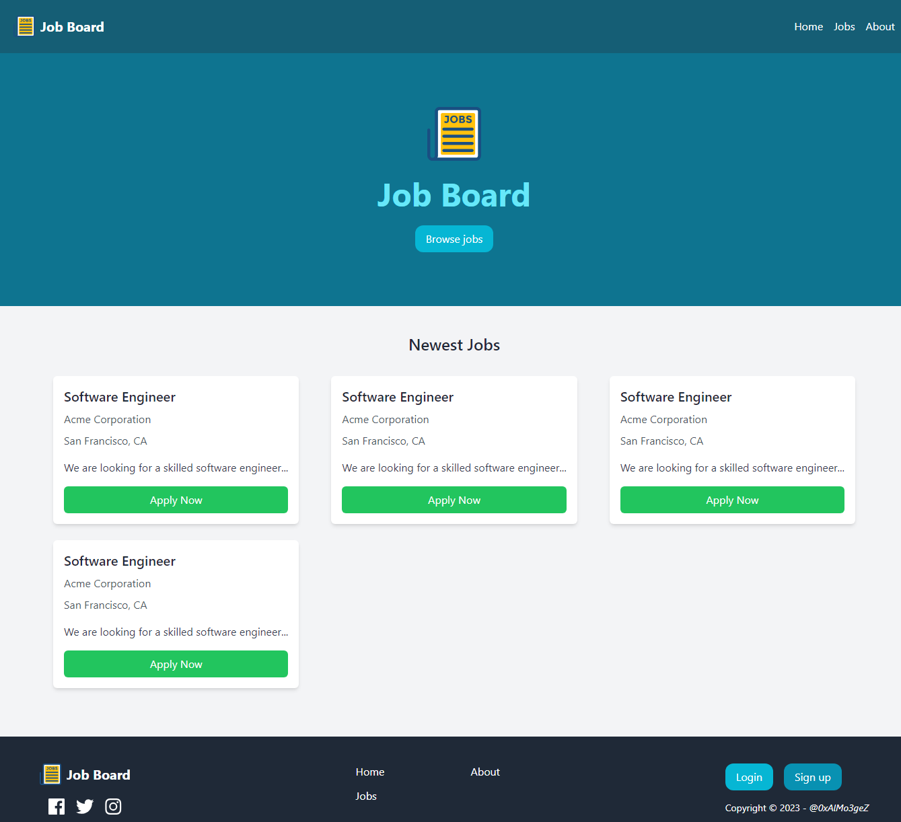

# Job Board (Django/Nuxt.js)



## Installation

```bash
# Clone the repository
git clone https://github.com/0xAlMo3geZ/job_board.git

# Change directory to the project folder
cd job_board

# Create a virtual environment (optional but recommended)
python3 -m venv venv

# Activate the virtual environment
source venv/bin/activate  # On Windows: venv\Scripts\activate

# Install dependencies (Back-end)
pip install -r requirements.txt

# Install dependencies (Front-end)
cd frontend
npm install
```

## Usage

```bash
# Run the database migrations
cd backend
python3 manage.py makemigrations
python3 manage.py migrate

# Start the Server (Backend)
python3 manage.py runserver

# Start the Server (Frontend)
cd frontend
npm run dev

# Access the Web Application
https://localhost:3000
```

## Project Structure

```
.
├── README.md
├── backend
│   ├── backend
│   ├── db.sqlite3
│   ├── job
│   └── manage.py
├── frontend
│   ├── app.vue
│   ├── assets
│   ├── components
│   ├── layouts
│   ├── node_modules
│   ├── nuxt.config.ts
│   ├── package-lock.json
│   ├── package.json
│   ├── pages
│   ├── public
│   ├── server
│   ├── stores
│   ├── tailwind.config.js
│   └── tsconfig.json
├── requirements.txt
└── venv
    ├── bin
    ├── include
    ├── lib
    ├── lib64 -> lib
    └── pyvenv.cfg
```

## TODO:

```
[*] Set up the frontend
   - Create an empty project
   - Make sure you can run the project
   - Install Pinia
   - Install tailwind
[*] Set up a simple layout (menu, footer, etc)
[*] Create a static frontpage
[*] Create a static about page
[*] Create a static browse page
[*] Create a static detail page
[*] Create a static log in page
[*] Create a static sign up page
[*] Create a static page for creating jobs
[*] Create static page for “my jobs”
[*] A job position should be a component
[*] Implement state management for users
[*] When authenticated, replace footer buttons with “create job” button
[*] Set up the backend
   - Create virtual environment, install Django, Django Rest Framework, Cors headers and Djoser
   - Create an empty Django project
   - Configure the settings and urls.py
[*] Create app for jobs
[*] Set up database models
[*] Make front page dynamic
   - Serializer
   - View
   - Frontend
[*] Make detail dynamic (Separate serializer with more data)
[*] Make browse dynamic
[*] Make it possible to sign up
[*] Make it possible to log in
[*] Initialize the user store after refresh
[*] Make it possible to log out
[*] Show your jobs
[*] Make it possible to create a job
[*] Make it possible to delete job
[*] Make it possible to edit a job
[*] Implement meta data on pages
```
